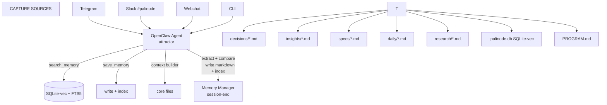

# Palinode — Implementation Plan

## The Principle

Start with the smallest thing that proves the architecture works. Add layers only after the core demonstrates value.

---

## Phase 0: MVP (1 week)

**Goal:** Prove that file-based memory + vector search + session-end extraction actually helps across sessions.

### Components

**1. Vector store: SQLite-vec**

- Embedded, zero server, single file
- Install: `pip install sqlite-vec`
- Schema: `chunks` table (id, file_path, section_id, category, content, metadata_json) + `chunks_vec` virtual table for embeddings
- Location: `~/.palinode/.palinode.db`

**2. Embedding model: BGE-M3 via Ollama**

- Already available on ***REMOVED***69
- Pull if needed: `ollama pull bge-m3`
- 1536-dimension dense vectors, 8K context window

**3. File watcher + indexer daemon**

- Python `watchdog` watching `~/.palinode/`
- On file change: parse markdown → split by headings → embed sections → upsert to SQLite-vec
- On delete: remove vectors for that file_path
- Lightweight systemd service on your-server

**4. Memory manager (session-end extraction)**

- Runs as the agent's last action before session close
- Extraction prompt: given last N turns + summary, extract typed items (ProjectSnapshot, Decision, PersonMemory, ActionItem, Insight) — max 5 items
- Update logic: for each candidate, search SQLite-vec for similar existing items → LLM decides ADD/UPDATE/NOOP
- Writes to markdown files + triggers re-index

**5. Context builder (session-start injection)**

- Phase 1 only (no two-phase yet): load profile YAML + active project program.md + core decisions
- Token budget: ~2K max
- Replace current MEMORY.md reading with this

**6. Two agent tools**

- `search_memory(query, category?, limit?)` → semantic search over SQLite-vec
- `save_memory(content, category, entities?)` → write to markdown + index

### Scope Limits (MVP)

- Only index `people/` and `projects/` initially
- Single writer (attractor agent only)
- No consolidation cron yet
- No entity linking yet
- No MCP exposure yet
- No multi-agent readers yet

### Success Criteria (after 1 week)

- [ ] Agent remembers project state across sessions without reading MEMORY.md
- [ ] Agent can search memory semantically and get relevant results
- [ ] Paul re-explains stable facts less often than before
- [ ] System survives agent restart, daemon restart, machine reboot

---

## Phase 0.5: Capture Expansion (during/after MVP week)

**Goal:** Multiple entry points feeding the same pipeline.

- Slack: create `#palinode` channel, webhook or bot that forwards to extraction pipeline
- Telegram: formalize the existing "message me → I remember" into proper Palinode writes
- laptop watch folder: `~/Palinode-Inbox/` synced via Syncthing to `~/.palinode/inbox/raw/`
- Ingestion pipeline daemon: watches `inbox/raw/`, dispatches by file type:
  - PDF → text extraction → LLM summarize → write to `research/`
  - Audio → Transcriptor API → transcript → summarize → write to `research/`
  - URL (saved as .url or .webloc file, or text file containing URL) → fetch → extract → summarize
  - Markdown/text → classify → file directly
- Web capture: agent command "save URL" → fetch → readability → summarize → file

---

## Phase 1: Core Memory + Two-Phase Injection (week 2)

**Goal:** Smart context assembly replaces brute-force MEMORY.md loading.

- Implement core memory files: `people/core.md`, `projects/*/program.md`, `decisions/core.md`
- Two-phase injection:
  - Phase 1: profile + core memory (~1-2K tokens)
  - Phase 2: after first user message, retrieve topic-specific memories from SQLite-vec
- Retire MEMORY.md reading (keep file for reference, stop injecting it)

---

## Phase 2: Consolidation + Entity Linking (week 3-4)

**Goal:** Memory improves over time instead of accumulating noise.

- Weekly consolidation cron:
  - Merge daily notes → weekly summaries per project
  - Detect and mark superseded decisions
  - Extract cross-project insights
- Entity catalog: `people/index.yaml`, `projects/index.yaml`
- Forward linking: extraction adds `entities:` to frontmatter
- Backward linking: weekly scan for unlinked references

---

## Phase 3: Migration + Scale (week 4+)

**Goal:** Incorporate existing knowledge; prepare for growth.

- Selective backfill from Mem0 (2,632 attractor memories → filter for quality → write to Palinode)
- Selective backfill from QC MCP (14K contexts → extract high-value items → write to Palinode)
- Split remaining MEMORY.md sections into proper Palinode files
- Evaluate: SQLite-vec vs LanceDB vs keeping Qdrant as the system grows
- Quality metrics: start logging injected memory IDs, vector hits, user corrections

---

## Phase 4: Multi-Agent + MCP (future)

**Goal:** All agents share Palinode; external tools can access it.

- MCP server wrapping Palinode's search/save API
- Multi-agent read access (governor, gradient, emission can query Palinode)
- Consider LangMem integration for extraction/consolidation functions
- Evaluate CortexaDB for hybrid vector+graph+temporal queries

---

## Capture Architecture

### Three Capture Modes

**Mode 1: Quick Capture (thoughts, decisions, context)**

- Telegram → OpenClaw agent → extract → write to Palinode
- Slack → dedicated #palinode channel → webhook or bot → extract → write
- Webchat → same as Telegram (already works)
- CLI → `palinode add "Alice prefers single-page checkout"` (future)
- All go through the same extraction pipeline: classify → typed schema → write markdown → index

**Mode 2: Document Ingestion (files that need processing)**

- Watch folder on laptop: `~/Palinode-Inbox/` (synced via Syncthing or rsync to your-server)
- Watch folder on your-server: `~/.palinode/inbox/raw/`
- Processing pipeline by file type:
  - `.pdf` → extract text (pdftotext/pymupdf) → LLM summarize + extract → write to `research/` or `insights/`
  - `.m4a/.mp3/.wav` → Transcriptor (***REMOVED***61) → transcript → LLM summarize → write to `research/`
  - `.mp4/.mkv` → extract audio → Transcriptor → same as audio
  - `.md/.txt` → classify directly → file into appropriate bucket
  - `.html` → readability extract → same as text
- Each ingested document produces:
  - A source reference file: `research/YYYY-MM-DD-title.md` with frontmatter (source_url, source_file, date, tags)
  - Extracted insights filed into appropriate buckets (decisions/, insights/, etc.)
  - The raw file optionally archived on NAS

**Mode 3: Web Capture (URLs, articles, papers)**

- Telegram/Slack: "save <https://example.com/article>" → agent fetches → extracts → summarizes → files
- Browser extension (future, or reuse QC MCP's Chrome extension concept)
- CLI: `palinode ingest https://example.com/article`
- Processing: fetch URL → readability extract → LLM summarize + extract key points → write to `research/`

### What Goes Where

| Input | Processing | Destination |
|---|---|---|
| "Remember Alice prefers single-page checkout" | Extract: Decision about checkout flow | `decisions/checkout-design.md` + cross-ref `people/alice.md` |
| "Save this: curation > volume for LoRA" | Extract: Insight | `insights/curation-over-volume.md` |
| PDF dropped in inbox | Extract text → summarize → extract | `research/YYYY-MM-DD-title.md` + insights if any |
| Audio recording (class) | Transcribe → summarize → extract | `research/class-week-N.md` + project updates |
| URL of article | Fetch → extract → summarize | `research/YYYY-MM-DD-title.md` with source_url |
| Agent conversation (auto) | Session-end extraction | Various buckets based on content |

### Research vs. Memory

**Research** (`research/`) = reference material. Source documents, article summaries, transcripts. Things you might want to look up later. Kept with provenance (source URL/file, date, original author).

**Memory** (everything else) = distilled knowledge. What you know, who you know, what you decided, what you learned. Derived from research and experience.

Research feeds memory. An article about memory consolidation goes into `research/`. The insight you extracted from it ("consolidation should run weekly, not continuously") goes into `insights/`. The decision you made based on it ("Palinode will use weekly consolidation cron") goes into `decisions/`.

### laptop Watch Folder Sync

**Option A: Syncthing** (already running between laptop ↔ your-server for GrueBrain)

- Add sync folder: laptop `~/Palinode-Inbox/` ↔ your-server `~/.palinode/inbox/raw/`
- Files appear on your-server → file watcher picks them up → processing pipeline
- After processing, move raw file to `inbox/processed/` (Syncthing ignores processed/)

**Option B: rsync cron**

- laptop runs `rsync ~/Palinode-Inbox/ your-server:~/.palinode/inbox/raw/` every 5 min
- Simpler, less real-time, no persistent daemon on laptop

**Option C: NAS as intermediary**

- laptop drops files into NAS folder (already mounted)
- Clawdbot watches NAS folder
- Adds a hop but leverages existing NAS mount

## Architecture Diagram



---

## Embedding Strategy

**Dual-backend architecture:**

| Backend | Model | Dimension | Used For | Runs On |
|---|---|---|---|---|
| **Local (default)** | BGE-M3 via Ollama | 1024 | Core memory files (people, projects, decisions, insights) | ***REMOVED***61 (5060) |
| **Cloud (ingestion)** | gemini-embedding-2-preview | 768 → 1536 → 3072 (Matryoshka) | Research, PDFs, audio, web captures — less sensitive external docs | Google API (Gemini Ultra) |

**Why dual:**

- Core memory (personal context, people, decisions) stays **private** — never leaves the network
- Research/ingestion (external articles, transcripts, PDFs) gets **better embeddings** — multimodal, higher quality, direct PDF/audio embedding without text extraction
- Matryoshka: start at 768d, upgrade to 1536 or 3072 later without re-architecting

**Multimodal win for ingestion:**

```
Current:  PDF → extract text → embed text → index
Future:   PDF → embed directly via Gemini → index (skip extraction for search)
          Audio → embed directly → index (still transcribe for human readability)
```

**Config:**

```yaml
embedding:
  default:
    provider: ollama
    model: bge-m3
    url: http://***REMOVED***61:11434
    dimension: 1024
  ingestion:
    provider: gemini
    model: gemini-embedding-2-preview
    apiKey: ${GEMINI_API_KEY}
    dimension: 768        # start small, upgrade later
    taskType: RETRIEVAL_DOCUMENT  # or RETRIEVAL_QUERY for search
```

**Phase 0 MVP:** BGE-M3 only (done, working, tested)
**Phase 0.5 (ingestion):** Add Gemini backend for research/ pipeline
**Phase 2+:** Evaluate switching core memory to Gemini if quality gap warrants it

## Decision Log

| Decision | Choice | Rationale |
|---|---|---|
| Vector store | SQLite-vec | Simplest, embedded, no server, matches file-based philosophy |
| Embedding (core memory) | BGE-M3 via Ollama (local) | Private, no API dependency, good quality, proven in testing |
| Embedding (ingestion) | gemini-embedding-2-preview (cloud) | Multimodal (direct PDF/audio), Matryoshka dims, top-tier quality. Research docs are less sensitive. Gemini Ultra included. |
| Memory manager cadence | Session-end inline | Fast for single user; cron for consolidation later |
| Context injection | Two-phase (core + topic-specific) | Avoids loading 22K tokens; cold-start safe |
| Multi-agent writes | Single writer (attractor) | Avoids concurrency complexity; revisit later |
| Source of truth | Markdown files, git-versioned | Human-readable, browsable, survives everything |
| Infrastructure approach | Best tool for job, not existing tool | SQLite-vec over Qdrant for this use case |
| **Relationship to OpenClaw** | **OpenClaw plugin (`openclaw-palinode`)** | OpenClaw's Plugin SDK has exactly the hooks we need: `before_agent_start` (inject context), `agent_end` (extract memories), tool registration, CLI commands. The Mem0 plugin is a complete reference implementation. Palinode is still a standalone service underneath — the plugin is just the integration layer. |
| MEMORY.md transition | Coexist → gradual replacement via `bootstrap-extra-files` hook | OpenClaw's existing hook can inject Palinode core memory files into bootstrap context. Just a config change, no code. |
| Mem0 | Run in parallel → disable → remove | Install `openclaw-palinode` alongside `openclaw-mem0`. Both run. Once Palinode proves better, disable Mem0's autoRecall/autoCapture. Eventually remove the extension. |

---

## Open Items

- [ ] Write PROGRAM.md (the spec that drives the memory manager)
- [ ] Design extraction prompt and update prompt (concrete Claude tool schemas)
- [ ] Design context builder assembly logic
- [ ] Choose: build file watcher from scratch or adapt existing tool (qdrant-markdown-indexer, LlamaIndex)?
- [ ] Determine: does the file watcher run on your-server or should Ollama embeddings happen locally?
- [ ] Plan: how to handle the transition period where both MEMORY.md and Palinode coexist
